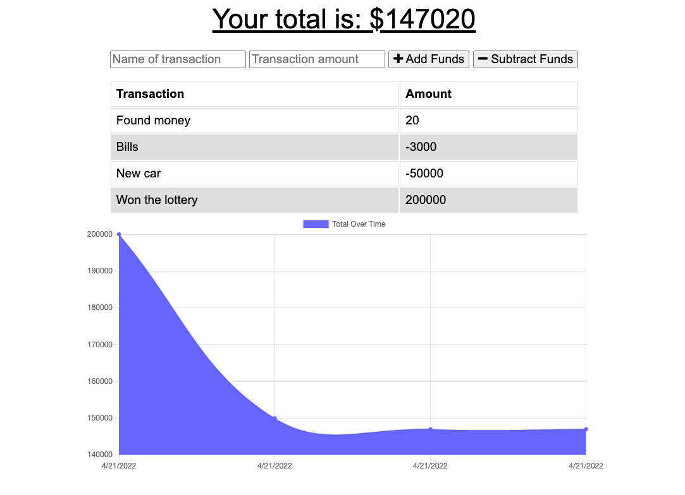

# Budget Tracker

## Description
For this challenge we are given a functional budget tracking application and asked to add progressive web application functionality by using a service worker and indexedDB to make the app functional offline. We also add the option of installing the app directly to your computer or mobile device.

[Test the application out here!](https://protected-fortress-39036.herokuapp.com/)



## Acceptance Criteria
```
GIVEN a budget tracker without an internet connection
WHEN the user inputs an expense or deposit
THEN they will receive a notification that they have added an expense or deposit
WHEN the user reestablishes an internet connection
THEN the deposits or expenses added while they were offline are added to their transaction history and their totals are updated
```

## Links
[GitHub repo](https://github.com/ashleyhodge/pwa-budge-tracker)  
[Heroku App](https://protected-fortress-39036.herokuapp.com/)

### Created By:
[Ashley Hodge](https://github.com/ashleyhodge)